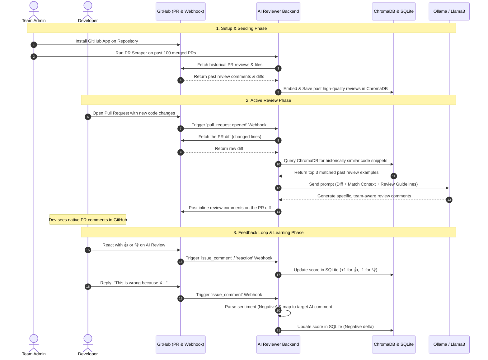

# 📋 Team-Aware AI Code Reviewer — Project Info

---

## 1. 🎯 Project Theme & Goal

**What is this project?**

This is a **Team-Aware AI Code Reviewer** — an intelligent bot that automatically reviews Pull Requests on GitHub by learning from your team's past review history. Unlike generic AI code reviewers that give cookie-cutter feedback, this system **adapts to your team's specific coding patterns and review style**.

**Main Goal:** When a developer opens a Pull Request, the bot:
1. Receives the PR event via a GitHub Webhook.
2. Fetches the code diff (changed files).
3. Searches a **vector database (ChromaDB)** for historically similar code issues your team has reviewed before.
4. Sends the new code + historical context to a **local LLM (Ollama/Llama3)** to generate a review comment.
5. Posts the review comment back on the PR automatically.
6. Tracks developer feedback (👍/👎 reactions) to score how useful AI comments are over time.

**What makes this unique?**
- **Team-Aware Context** — Uses vector similarity search (ChromaDB + sentence-transformers) to find past review patterns and inject them as context into the LLM prompt. The AI doesn't just review code generically — it mimics how *your* team reviews code.
- **Self-Improving Feedback Loop** — Developers can react (👍/👎) to AI comments. These reactions update a score in a local SQLite database, creating a foundation for the AI to learn which reviews are helpful.
- **Fully Local & Private** — Runs Ollama (Llama3) locally, so no code leaves your infrastructure. No OpenAI API keys needed.
- **Historical PR Scraping** — Can scrape merged PRs from any GitHub repo to auto-build a training dataset of real review examples.
- **Docker-Ready** — Full `docker-compose.yml` with backend + Ollama services for one-command deployment.

---

## 2. ✅ Completion Status

### What's Built (Working)

| Component | Status | Description |
|---|---|---|
| FastAPI Webhook Server | ✅ Done | Receives & routes GitHub PR events |
| Webhook Signature Verification | ✅ Done | HMAC SHA256 security check |
| GitHub App Authentication | ✅ Done | JWT-based App auth via PyGithub |
| PR Diff Fetching | ✅ Done | Extracts changed files from PRs |
| ChromaDB Vector Store | ✅ Done | Persistent vector DB for code embeddings |
| Embedding Pipeline | ✅ Done | `embedder.py` seeds training data into ChromaDB |
| AI Reviewer (Ollama/Llama3) | ✅ Done | Generates reviews using LLM + historical context |
| PR Comment Posting | ✅ Done | Posts AI review comments back to GitHub PRs |
| Historical PR Scraper | ✅ Done | Scrapes merged PRs to build training dataset |
| Dataset Builder | ✅ Done | Extracts review examples from PR comments |
| Feedback Loop (Reactions) | ✅ Done | Tracks 👍/👎 reactions, updates scores in SQLite |
| Docker Deployment | ✅ Done | `docker-compose.yml` with backend + Ollama |
| Test Scripts | ✅ Done | `test_feedback.py` and `test_scraper.py` |

### What's Left (Incomplete / Placeholder)

| Item | Current State | What's Needed |
|---|---|---|
| `fixed_code` extraction | Placeholder string `"To be implemented..."` in [dataset_builder.py](file:///e:/gituhub%20ai%20reviewer/backend/services/dataset_builder.py#L59) | Need to compare before/after commits to extract the actual fix. Requires either extra GitHub API calls or LLM-based extraction. |
| Comment-reply feedback mapping | Partially implemented in [reaction_handler.py](file:///e:/gituhub%20ai%20reviewer/backend/services/reaction_handler.py#L31-L57) | `handle_comment_feedback()` detects keywords but cannot map replies to the specific AI comment. Needs PR comment threading logic. |
| Score-based re-training | Not started | No mechanism yet to use feedback scores to re-embed or re-weight training data. The scores are stored but never consumed. |
| Frontend / Dashboard | Not started | No UI to visualize AI review quality, scores, or historical data. |
| CI/CD Pipeline | Not started | No GitHub Actions or automated deployment workflow. |
| Comprehensive unit tests | Minimal | Only 2 test scripts exist. No pytest suite, no mocking, no CI integration. |
| `.env` security | ⚠️ Token exposed in `.env` | The `.env` file contains a real GitHub token in plaintext. Should be in `.gitignore` and rotated. |

> [!WARNING]
> The `.env` file currently has a hardcoded GitHub token. Rotate this token immediately and add `.env` to `.gitignore`.

**Verdict: ~75% Complete** — The core pipeline (webhook → diff → vector search → LLM review → post comment) is fully functional. The feedback loop stores data but doesn't close the loop back into training. No frontend exists.

---

## 3. 🚀 How to Run the Project

### Prerequisites
- Python 3.10+
- [Ollama](https://ollama.com/) installed (or Docker)
- A GitHub Account with a GitHub App or Webhook configured
- [ngrok](https://ngrok.com/) for local webhook testing

### Method 1: Docker (Recommended)

```bash
# 1. Clone the repo
git clone https://github.com/Krishnanikhil-eng/ai-code-reviewer.git
cd ai-code-reviewer

# 2. Create .env from example
cp backend/.env.example .env
# Edit .env with your GitHub App ID, private key path, and webhook secret

# 3. Start all services
docker-compose up -d

# 4. Pull the LLM model (first time only)
docker exec -it ai-reviewer-ollama ollama pull llama3

# 5. Backend is now live at http://localhost:8000
```

### Method 2: Local (Manual)

```bash
# 1. Create and activate virtual environment
python -m venv venv
venv\Scripts\activate          # Windows
# source venv/bin/activate     # Mac/Linux

# 2. Install dependencies
pip install -r requirements.txt

# 3. Create .env in root
cp backend/.env.example .env
# Edit .env with your credentials

# 4. Seed the vector database with training data
python embedder.py

# 5. Start Ollama and pull the model
ollama serve
ollama pull llama3

# 6. Run the FastAPI server
cd backend
python main.py
# Server starts at http://localhost:8000
```

### Connecting to GitHub

```bash
# Expose your local server to the internet
ngrok http 8000
```

Then in GitHub → Repo Settings → Webhooks:
- **Payload URL:** `https://<YOUR_NGROK_URL>/webhook`
- **Content type:** `application/json`
- **Secret:** Same as `GITHUB_WEBHOOK_SECRET` in `.env`
- **Events:** Select **Pull requests** (and optionally **Issue comments** for feedback)

### Verify It Works

Open a new PR on the connected repo → the bot should post an AI-generated review comment within 30–60 seconds.

---

## 4. 💡 Improvements & Next Steps

### High Priority

| Improvement | Why It Matters |
|---|---|
| **Close the feedback loop** — Use stored scores to re-weight or re-embed training examples | Currently scores are stored but never influence future reviews. This is the core value proposition. |
| **Fix `fixed_code` extraction** — Compare commits before/after a review comment | Training data currently has placeholder values, which weakens the LLM context. |
| **Inline PR review comments** — Use `create_review()` with file-level positioning | Currently posts general issue comments. Inline comments (on specific lines) would be far more useful. |
| **Rotate the exposed GitHub token** and add `.env` to `.gitignore` | Security risk. |

### Medium Priority

| Improvement | Why It Matters |
|---|---|
| **Add a web dashboard** (Flask/Streamlit) | Visualize review quality, feedback scores, and team patterns. |
| **Chunking for large diffs** | Currently sends entire file patches to the LLM. Large files may exceed token limits. |
| **Multi-language support in suggested fixes** | Code blocks are hardcoded as `python`. Should detect language from file extension. |
| **Rate limiting & retry logic** for Ollama and GitHub API calls | Production resilience. |
| **Proper pytest suite** with mocks and CI integration | Only 2 manual test scripts exist. |

### Nice to Have

| Improvement | Why It Matters |
|---|---|
| **Swap Ollama for a cloud LLM option** (OpenAI, Gemini) as a configurable backend | Flexibility for teams without GPU. |
| **GitHub App Marketplace listing** | Easier installation for other teams. |
| **Async embeddings** — Background job to re-embed when training data changes | Keep vector store fresh automatically. |
| **Comment deduplication on re-pushes** | Avoid posting duplicate reviews when a PR is updated. |

---

## 5. 📁 Project Structure Overview

```
ai-code-reviewer/
├── backend/                    # FastAPI application
│   ├── main.py                 # Webhook endpoint + event routing
│   ├── core/
│   │   ├── config.py           # Pydantic settings (env vars)
│   │   ├── security.py         # HMAC signature verification
│   │   ├── github_client.py    # GitHub App authentication + comment posting
│   │   └── database.py         # SQLite operations for feedback tracking
│   └── services/
│       ├── pr_processor.py     # Main PR processing pipeline
│       ├── pr_history_scraper.py  # Scrapes merged PRs for training data
│       ├── dataset_builder.py  # Extracts review examples into JSON
│       └── reaction_handler.py # Handles 👍/👎 reactions on AI comments
├── ai_engine/
│   └── reviewer.py             # LLM-based code review generation (Ollama)
├── vector_store/
│   └── chroma_client.py        # ChromaDB persistent vector DB interface
├── database/
│   ├── schema.sql              # SQLite schema for feedback loop
│   ├── feedback_loop.db        # SQLite database file
│   └── training_data.json      # Historical review examples (127KB, pre-loaded)
├── embedder.py                 # Seeds training data into ChromaDB
├── docker-compose.yml          # Docker stack (backend + Ollama)
├── Dockerfile                  # Python 3.11-slim image for backend
├── requirements.txt            # Python dependencies
└── .env                        # Environment configuration (secrets)
```

---

> [!NOTE]
> The project has a solid working pipeline from webhook to AI review. The main gaps are closing the feedback loop back into training and adding inline PR comments for a better developer experience.

---

## 6. 🤖 AI / ML / Deep Learning Tools Used

### Libraries & Tools

| Tool / Library | Type | Where Used | What It Does |
|---|---|---|---|
| **Ollama (Llama3)** | 🤖 Large Language Model (LLM) | [reviewer.py](file:///e:/gituhub%20ai%20reviewer/ai_engine/reviewer.py#L86-L97) | Generates AI code review comments by analyzing PR diffs with team-context prompts. Called via local REST API (`/api/generate`). |
| **sentence-transformers (`all-MiniLM-L6-v2`)** | 🧠 Deep Learning (NLP Embeddings) | [embedder.py](file:///e:/gituhub%20ai%20reviewer/embedder.py#L36) and [reviewer.py](file:///e:/gituhub%20ai%20reviewer/ai_engine/reviewer.py#L18-L20) | Converts code snippets into 384-dimensional vector embeddings for similarity search. This is a **pre-trained transformer model** from Hugging Face. |
| **ChromaDB** | 📊 Vector Database (AI Infrastructure) | [chroma_client.py](file:///e:/gituhub%20ai%20reviewer/vector_store/chroma_client.py) | Stores and queries embeddings using cosine similarity. Powers the "find similar past reviews" feature. |

### AI Pipeline Flow (RAG Architecture)

```
New PR Code Diff
       │
       ▼
┌──────────────────────────┐
│  sentence-transformers   │  ← Deep Learning (embedding model)
│  (all-MiniLM-L6-v2)     │
└──────────┬───────────────┘
           │ vector embedding
           ▼
┌──────────────────────────┐
│  ChromaDB Vector Search  │  ← AI Infrastructure (similarity search)
│  "Find similar reviews"  │
└──────────┬───────────────┘
           │ top 3 similar examples
           ▼
┌──────────────────────────┐
│  Ollama / Llama3 LLM     │  ← Generative AI (LLM)
│  "Generate review using  │
│   team context + code"   │
└──────────┬───────────────┘
           │ JSON response
           ▼
    AI Review Comment
    posted on GitHub PR
```

### AI/ML Category Breakdown

| Category | Present? | Details |
|---|---|---|
| **Machine Learning** | ✅ Yes | Vector similarity search (ChromaDB) is an ML technique |
| **Deep Learning** | ✅ Yes | `sentence-transformers` uses a deep neural network (transformer architecture) to generate embeddings |
| **Generative AI / LLM** | ✅ Yes | Ollama runs Llama3 (an 8B parameter large language model) locally for text generation |
| **NLP (Natural Language Processing)** | ✅ Yes | Both the embedding model and LLM process natural language + code |
| **RAG (Retrieval-Augmented Generation)** | ✅ Yes | Retrieves similar examples from ChromaDB, then augments the LLM prompt with that context |
| **Traditional ML (sklearn, etc.)** | ❌ No | No traditional ML models (regression, classification, etc.) |
| **Computer Vision** | ❌ No | Not used |

> This project is a **RAG-based (Retrieval-Augmented Generation) AI system** — it combines Deep Learning embeddings (sentence-transformers) for semantic code search, a Vector Database (ChromaDB) for similarity matching, and a Local LLM (Ollama/Llama3) for generating intelligent, team-aware code reviews. It is not just an API wrapper — the vector search + historical context makes it genuinely "team-aware."

---

## 7. 🌐 Real-World Architecture & User Interaction Flow

To understand how this system operates in a production software engineering environment, we must look at it from a **Product Architecture** and **User Experience (UX)** perspective.

### 7.1 Product Category & Delivery Model
We are building a **GitHub App (SaaS or Self-Hosted DevTool Integration)**.
* **Not a Browser Extension / VS Code Extension**: Developers do not want another extension running in their IDE or browser that they have to manually trigger. They want code reviews to occur asynchronously and centrally during the Pull Request (PR) lifecycle.
* **The Main Interface is GitHub**: Developers never have to leave the GitHub PR interface. The AI reviewer behaves exactly like a human senior engineer—reading diffs, leaving comments, and replying to queries.
* **Self-Hosted for Enterprises**: Because we use a local LLM (Ollama) and local embeddings, this product is highly attractive to enterprise companies who refuse to send their proprietary source code to external third-party APIs (like OpenAI or Anthropic). The backend and Ollama run in the company's private cloud infrastructure (e.g., AWS, GCP, or on-premise).

---

### 7.2 The User Roles (Personas)
1. **Software Developers (End Users)**:
   - *Goal*: Write code, submit Pull Requests, receive fast feedback, and iterate on code.
   - *Interaction*: They only interact with the bot inside GitHub (reading review comments, replying, or adding 👍/👎 reactions).
2. **Tech Leads & Code Owners (Curators)**:
   - *Goal*: Maintain code quality and establish review guidelines.
   - *Interaction*: They curate the vector database by marking reviews as high-quality, ensuring the AI learns from the team's best practices.
3. **Engineering Managers / VP of Engineering (Administrators)**:
   - *Goal*: Measure engineering velocity, code quality, and bot efficiency.
   - *Interaction*: They use the **Web Analytics Dashboard** to monitor performance.

---

### 7.3 Web Dashboard vs. GitHub Interaction
The product is split into two distinct frontends:

```
┌─────────────────────────────────────────────────────────────────────────┐
│                          AI CODE REVIEWER PRODUCT                       │
└────────────────────────────────────┬────────────────────────────────────┘
                                     │
                  ┌──────────────────┴──────────────────┐
                  ▼                                     ▼
      ┌───────────────────────┐             ┌───────────────────────┐
      │  GitHub PR Interface  │             │   Web Admin Console   │
      │  (Main Dev Workspace) │             │  (Analytics & Config) │
      └───────────┬───────────┘             └───────────┬───────────┘
                  │                                     │
                  ├─ View AI review comments            ├─ View review accuracy scores
                  ├─ Leave 👍/👎 reactions on comments   ├─ Manage vector database items
                  └─ Reply to threads to explain/argue  └─ Configure LLM prompt rules
```

1. **GitHub PR Interface (95% of Interaction)**: This is where developers work. The reviews, inline code suggestions, and reply-based feedback threads all happen here.
2. **Web Admin Console / Dashboard (5% of Interaction)**: A dedicated web portal used by managers and leads to:
   - See how many PRs were reviewed and how much developer time was saved.
   - View analytics on feedback loops (e.g., "Bot has 89% positive reaction rate this week").
   - Manage the ChromaDB Vector Store (e.g., search through embedded patterns and delete outdated code rules).
   - Configure integration settings (repositories connected, LLM system prompts, review strictness).

---

### 7.4 The Complete Real-World Workflow (Step-by-Step)

Here is the exact lifecycle of the product in action from the moment a company decides to adopt it:



#### Step 1: Installation & Initial Training (Seeding)
* **Action**: The tech lead installs our GitHub App and runs the `pr_history_scraper.py` against their repository.
* **Under the Hood**: The scraper fetches the team's historical pull requests, extracting the exact code snippets the team commented on and what they said. These are converted into embeddings and stored in ChromaDB. The bot is now "trained" on the team's specific review culture.

#### Step 2: The Developer Submits Code
* **Action**: A developer opens a Pull Request to fix a bug or add a feature.
* **Under the Hood**: GitHub fires a webhook event. Our FastAPI server catches it, fetches the PR diff, and searches ChromaDB to see if the developer is writing code similar to past bugs or patterns the team previously reviewed.

#### Step 3: AI Review Generation
* **Action**: The developer sees the bot post 2 or 3 review comments on their PR diff within a minute.
* **Under the Hood**: The LLM combines the new code changes with the retrieved past reviews. It says: *"Last time a developer wrote this, the tech lead asked to use a helper function instead. Let's do the same here."*

#### Step 4: The Developer Responds (Continuous Improvement)
* **Action**: The developer interacts with the comments. If a comment is great, they react with 👍. If it is a false positive, they reply: *"No, this is wrong because this is a separate thread."*
* **Under the Hood**: The webhook catches these replies and reactions. The system maps the feedback back to the specific AI comment and records the score in SQLite. 
* **Closing the Loop**: On the admin dashboard, low-scoring review templates are flagged for deletion from ChromaDB, while high-scoring ones are weighted heavily, constantly improving review quality without manual re-coding.

---

> [!IMPORTANT]
> This developer-first workflow is what makes the product incredibly easy to adopt: **zero setup for developers** (they just use GitHub as they always have), **high privacy for security officers** (runs on private servers), and **complete transparency for managers** (via the analytics dashboard).
