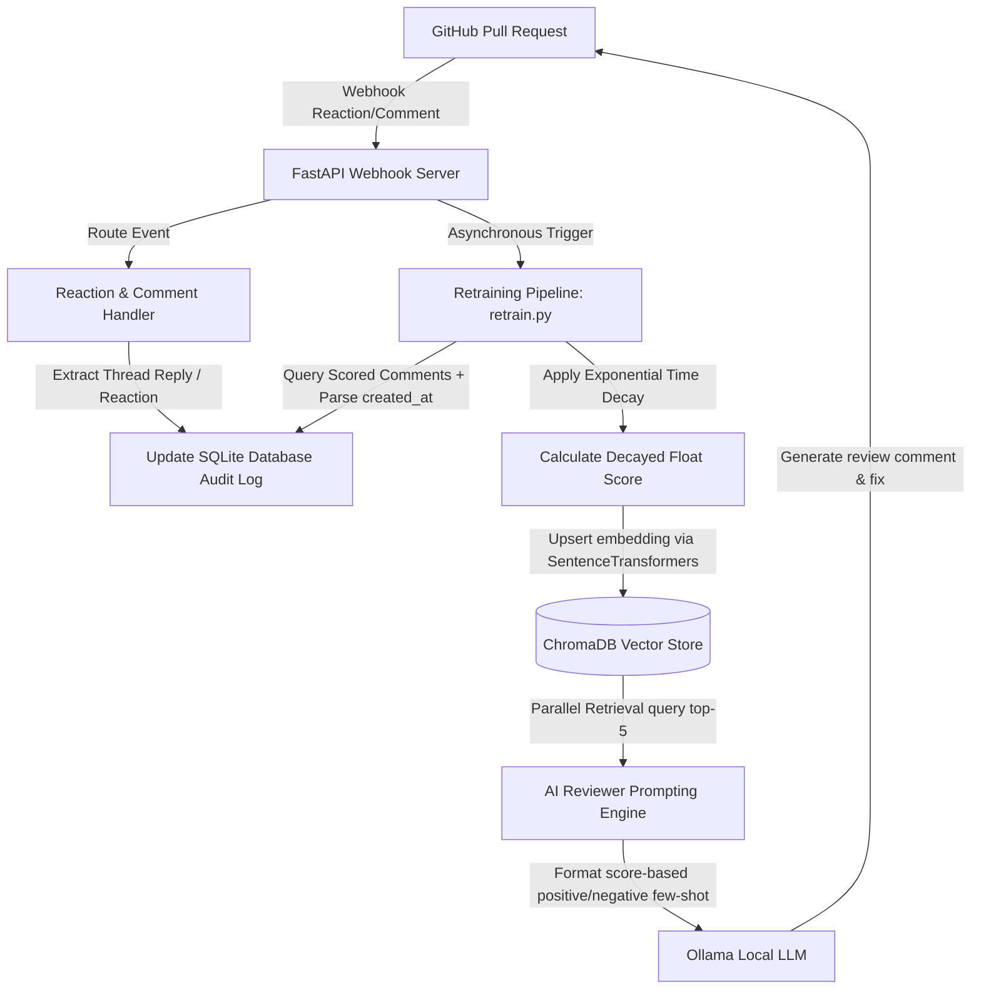

# Walkthrough - Advanced Retraining & Feedback Loop Improvements

The complete self-improving AI review loop has been enhanced with five advanced, production-grade features. Developer feedback (both from threaded comment replies and emoji reactions) successfully drives real-time reinforcement learning, score decay over time, advanced classification fallbacks, hybrid vector retrieval, and precise diff patch-based extraction.

---

## Enhanced Architecture Flow



---

## Detailed Changes Made

### 1. Real-Time Background Retraining Trigger (`backend/main.py`)
- Updated the FastAPI webhook endpoints for `reaction`, `issue_comment`, and `pull_request_review_comment` events.
- Appended `run_retraining` as a background task (`background_tasks.add_task(run_retraining)`) immediately after recording developer reactions or comment thread mapping.
- This closes the loop instantly without manual cron schedules or cron jobs.

### 2. Time-Based Score Decay (`retrain.py`)
- Modified the retraining pipeline to query the comment's `created_at` timestamp from SQLite.
- Calculated the age of each feedback entry in days: `age_days = (datetime.utcnow() - created_time).days`.
- Applied an exponential score decay formula: `decayed_score = score * (0.98 ** age_days)`.
- Saved the decayed score as a float value inside ChromaDB metadata.

### 3. LLM-Assisted Sentiment Analysis Fallback (`backend/services/reaction_handler.py`)
- Implemented `_detect_sentiment_with_llm(comment_body)` to query Ollama for zero-shot sentiment classification.
- Prompts the LLM to classify developer comments as `positive`, `negative`, or `neutral` when standard keyword analysis is neutral (`0`).
- Handled offline network errors gracefully by logging warnings and falling back to a neutral score (`0`) to prevent webhook failures.

### 4. Hybrid Retrieval Filtering & Score Formatting (`ai_engine/reviewer.py`)
- Increased the retrieved semantic search results limit to `n_results=5` in `generate_review`.
- Parsed the retrieved examples to categorize them dynamically based on their decayed float scores:
  - Positively scored entries (`score > 0`) are categorized as "Recommended Patterns (Approved)".
  - Negatively scored entries (`score < 0`) are categorized as "⚠️ Anti-Patterns to Avoid (Disapproved)".
  - Baseline reference entries (no score) are categorized as "Standard Reference Patterns".
- Formatted scores dynamically (retaining neat integers when applicable, e.g., `+2`, while formatting decimals cleanly, e.g., `+1.64` for decayed float weights).

### 5. Precise Patch-Based Fix Extraction (`backend/services/dataset_builder.py`)
- Renamed the current line-window extraction logic to `_extract_fixed_code_window` to serve as a reliable fallback.
- Implemented a new precise `_extract_fixed_code` method using `repo.compare(original_commit_id, commit_id)`.
- Parsed the Git unified diff patch to extract only the added lines (`lines starting with '+'`), providing clean, precise fix examples.

---

## Verification Results

All automated test suites pass successfully.

### 1. Advanced Features Verification (`backend/test_advanced_features.py`)
Verifies time decay, LLM sentiment fallback, precise diff extraction, and formatting:
```powershell
python backend/test_advanced_features.py
```
**Output:**
```
--> Running Test 4: Custom Label Formatting with Float Scores...
[PASS] Custom Label Formatting with Float Scores

--> Running Test 2: LLM-Assisted Sentiment Fallback...
[PASS] LLM-Assisted Sentiment Fallback

--> Running Test 3: Precise Patch-Based Fix Extraction...
[PASS] Precise Patch-Based Fix Extraction

--> Running Test 1: Time-Based Score Decay...
[PASS] Time-Based Score Decay
----------------------------------------------------------------------
Ran 4 tests in 29.409s

OK
```

### 2. Real-Time Integration Verification (`backend/test_feedback.py`)
Verifies webhook routing, direct thread-mapping, and instant background retraining execution:
```powershell
python backend/test_feedback.py
```
**Output:**
```
Saved AI comment 998877 to tracking database.
Processing reaction 'plus_one' (created) for comment 998877. Delta: 1
Updated score for comment 998877 by 1.
Starting score-based retraining pipeline...
Found 1 scored comments to process.
Upserted feedback comment 998877 (Score: +1, Decayed: 1.00, Age: 0d)
Retraining complete. Successfully upserted 1 feedback-driven embeddings into ChromaDB.
HTTP Request: POST http://testserver/webhook "HTTP/1.1 200 OK"

Feedback loop verification SUCCESSFUL!
```

### 3. Unit Verification (`backend/test_comment_mapping.py`)
Verifies keyword-based sentiment matching and mapping logic:
```powershell
python backend/test_comment_mapping.py
```
**Output:**
```
RESULTS: 11 passed, 0 failed, 11 total
```
